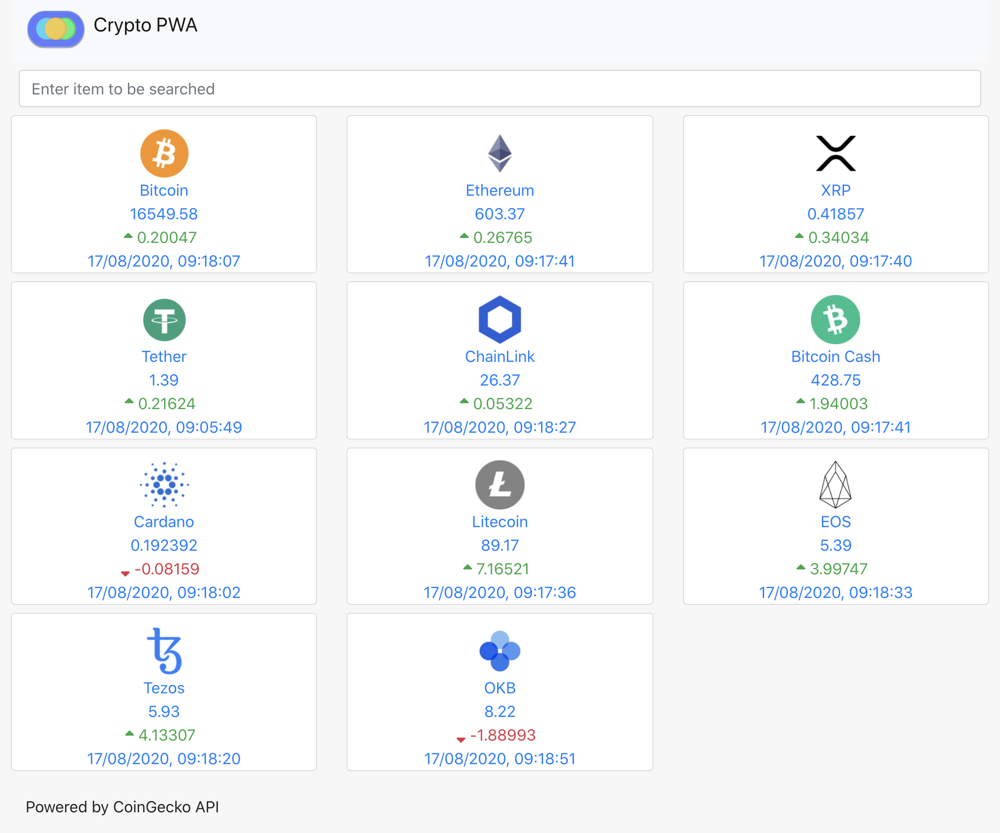
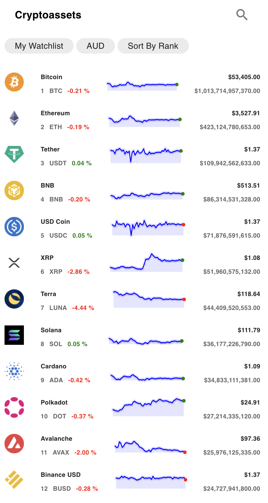

# React Cryptocurrency PWA
A Progressive Web Application built using React.js and CoinGekko API to display cryptocurrency price information in a responsive manner.

## ☕️ Features
* Choose your own coins to follow.
* Filter available coins. 
* Create and persist your watchlist to local storage.
* Install on Android or Iphone on the homescreen as a PWA.
* Demonstrates how to use Context API to manage data between components (One source of truth)
* Demonstrates how to use React hooks


<div>
  <p align="center">
    <a href="https://crypto-pwa.surge.sh/" target="_blank">
    🌟 Live app here 🌟
    </a>
  </p>
</div>

## Screens
 <p float="left">
  
  

</p>

## Install

using `npm`:

```bash
    $ cd client
    $ npm install
    $ npm start
```
Application will run on `localhost:3000`

### Made with

* [React](https://reactjs.org/)
* [Bootstrap](https://getbootstrap.com/)
* [CoinGekko](https://www.coingecko.com/en/api#explore-api)


